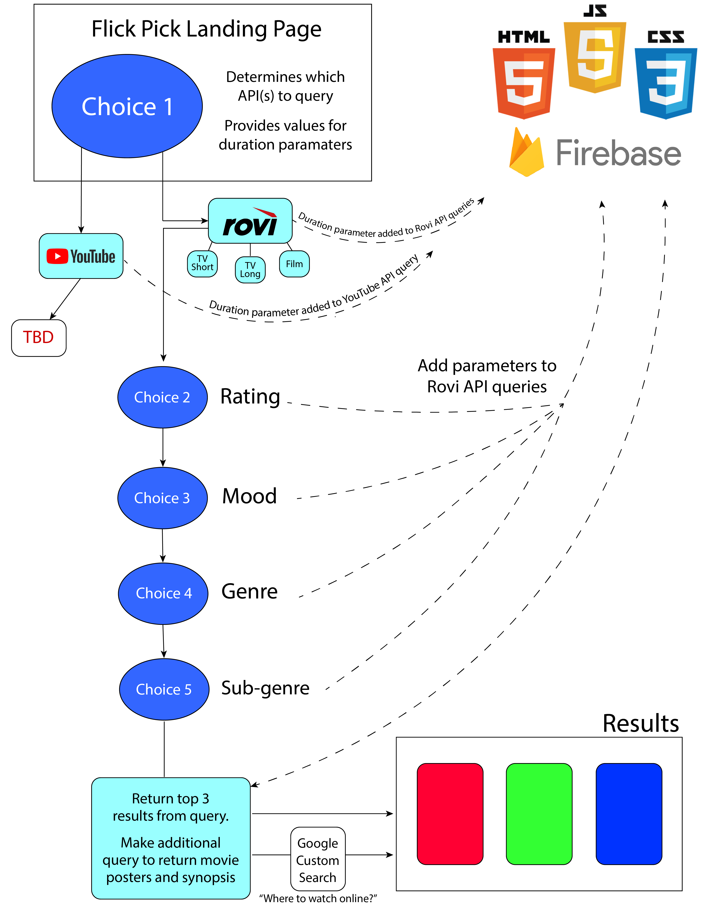

# Flick-Pick
This web-based application will help indecisive users narrow down the endless viewing choices available on popular streaming platforms such as Netflix, Hulu, Amazon Prime, and more!

### Flowcharts

The following flowchart (fig. 1) outlines the basic logic for the application as of 3-29-18. We will be walking the user through a series of choices, and their selections will be saved to our Firebase database, and used to query the [Rovi](http://developer.rovicorp.com/page) and [Google Custom Search](https://developers.google.com/custom-search/) APIs. The queries will return three suggestions for what the user should watch. 

There will be an additional functionality added to access the [YouTube API](https://developers.google.com/youtube/v3/) at a later stage in development. 

(figure 1)
